# A Fugue In Flask - Architecture

This document provides a comprehensive overview of the application architecture, explaining how the components work together and the design patterns used.

## Application Architecture Overview

A Fugue In Flask follows the **Application Factory Pattern** with a modular design using **Blueprints**. This architecture provides several benefits:

- Modular organization of code
- Easier testing and maintenance
- Flexibility in configuration
- Separation of concerns

Here's a visual representation of the application architecture:

```mermaid
graph TD
    A[app.py<br>Entry Point] --> B[create_app()<br>Application Factory]
    
    subgraph "Application Factory"
        B --> C[Configuration<br>Settings]
        B --> D[Extensions<br>Initialization]
        B --> E[Blueprint<br>Registration]
    end
    
    D --> F[Database<br>SQLAlchemy]
    D --> G[Authentication<br>Flask-Login]
    D --> H[Migrations<br>Flask-Migrate]
    
    E --> I[Main Blueprint<br>Home, About]
    E --> J[Auth Blueprint<br>Login, Register, Logout]
    
    I --> K[Templates<br>main/]
    J --> L[Templates<br>auth/]
    
    I --> M[Static Files<br>CSS, JS]
    
    F --> N[User Model]
    
    J --> O[Forms<br>Login, Register]
```

## Key Components

### 1. Application Factory (`app/__init__.py`)

The application factory is a function that creates and configures a new Flask application instance. This pattern allows for:

- Creating multiple application instances with different configurations (useful for testing)
- Avoiding circular imports by centralizing extension and blueprint registration
- Cleaner application structure

```python
def create_app(config_object='config.active_config'):
    app = Flask(__name__)
    app.config.from_object(config_object)
    
    # Initialize extensions
    db.init_app(app)
    migrate.init_app(app, db)
    login_manager.init_app(app)
    
    # Register blueprints
    app.register_blueprint(main_bp)
    app.register_blueprint(auth_bp, url_prefix='/auth')
    
    return app
```

### 2. Configuration System (`config.py`)

The configuration system implements a hierarchical approach:

- Base `Config` class with common settings
- Environment-specific config classes (Development, Testing, Production)
- Dynamic selection based on environment variables
- Secret management via environment variables

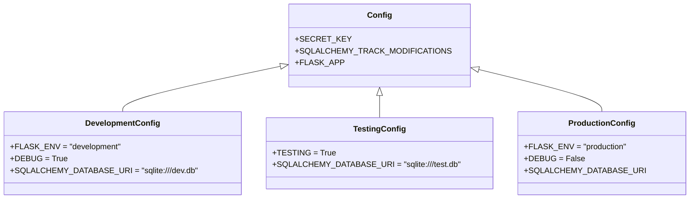

### 3. Blueprints (Routes)

Blueprints are logical collections of routes, templates, and static files. They help organize the application into distinct components:

- `main_bp`: General pages like home and about
- `auth_bp`: Authentication-related routes (login, register, logout)

```mermaid
flowchart TD
    A[Routes] --> B[main_bp]
    A --> C[auth_bp]
    
    B --> D[index&#40;&#41;/Home Page]
    B --> E[about&#40;&#41;/About Page]
    
    C --> F[login&#40;&#41;/Login Page]
    C --> G[register&#40;&#41;/Registration Page]
    C --> H[logout&#40;&#41;/Logout Handler]
    
    D --> I[main/index.html]
    E --> J[main/about.html]
    
    F --> K[auth/login.html]
    G --> L[auth/register.html]
```

### 4. Models

Models define the database schema using SQLAlchemy ORM:

- `User`: User authentication and profile information
- Integration with Flask-Login for session management

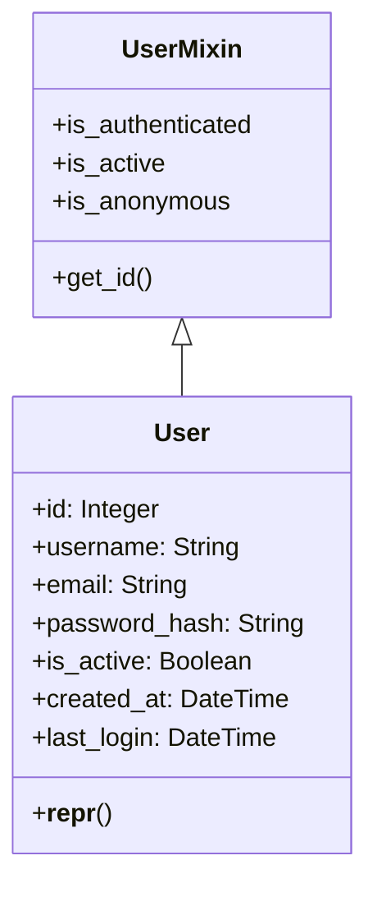

### 5. Forms

Forms are defined using Flask-WTF and WTForms:

- Form validation
- CSRF protection
- HTML rendering

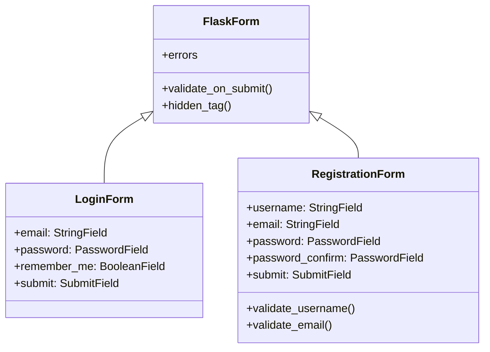

### 6. Templates

Templates are organized by blueprint and use Jinja2 templating engine:

- Base layout template with common elements
- Blueprint-specific templates that extend the base
- Flash messages for user feedback

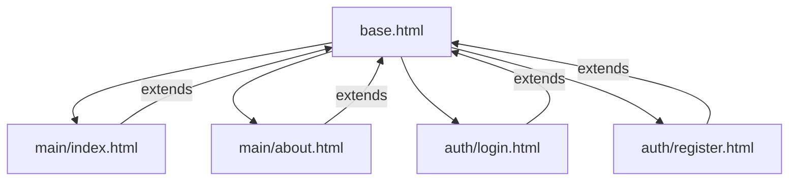

### 7. Extensions

Flask extensions provide additional functionality:

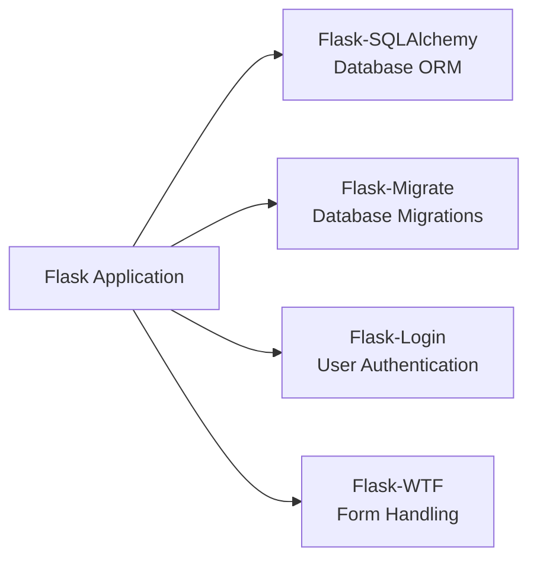

### 8. Static Files

Static files (CSS, JavaScript, images) are organized in the static directory.

## Data Flow

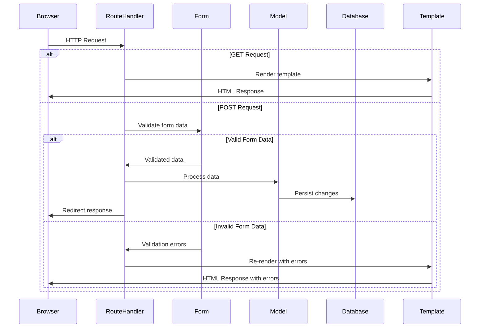

## Authentication Flow

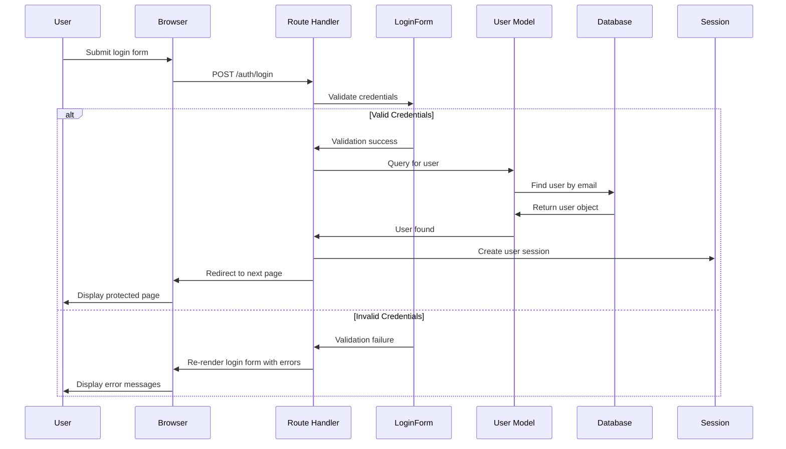

## Database Migrations

Database schema changes are managed through migrations:

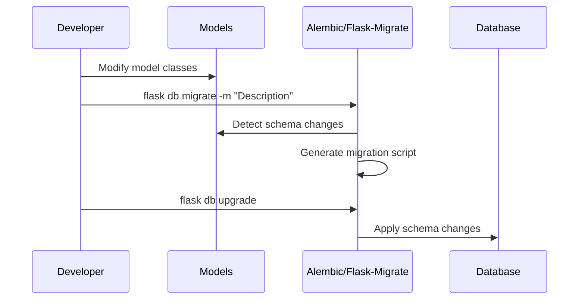

## Request Lifecycle

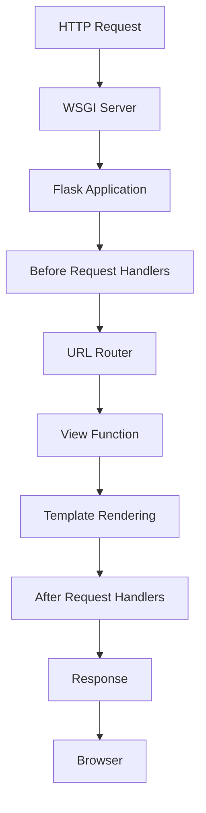

## Environment Variables

Environment variables control application behavior:

- `FLASK_APP`: Entry point (app.py)
- `FLASK_CONFIG`: Environment selection (development, testing, production)
- `SECRET_KEY`: Security key for sessions and CSRF protection
- `DATABASE_URI`: Database connection string

## Testing Approach

The application supports different types of tests:

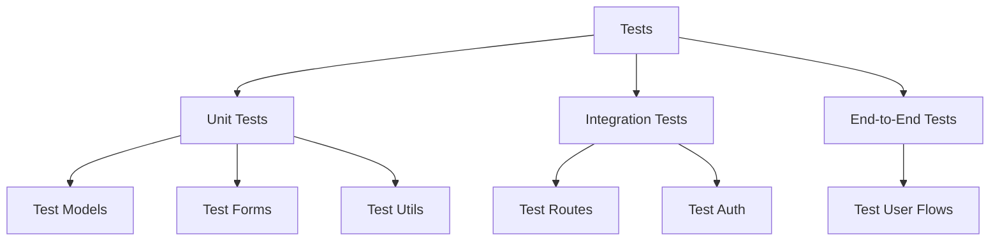

## Deployment Architecture

For Azure deployment, the application uses:

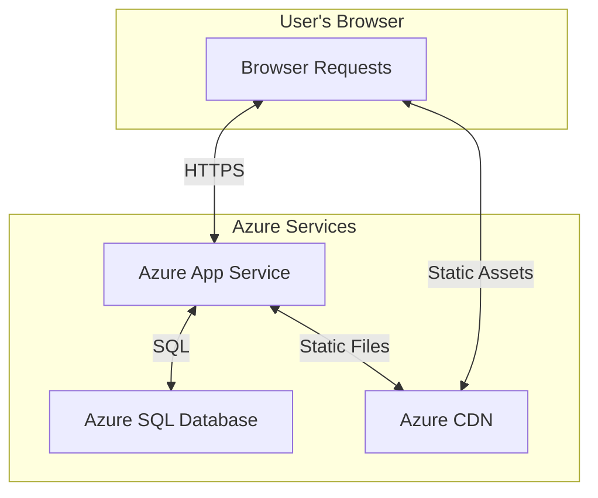

## Directory Structure Explained

```
app.py                  # Application entry point
config.py               # Configuration classes
requirements.txt        # Dependencies list
.env                    # Local environment variables (not in version control)
.env.example            # Example environment variables for reference
app/                    # Main application package
  ├── __init__.py       # Application factory function
  ├── models/           # Database models
  │   ├── __init__.py
  │   └── user.py       # User model for authentication
  ├── routes/           # Blueprint route handlers
  │   ├── __init__.py
  │   ├── main.py       # Main pages routes
  │   └── auth.py       # Authentication routes
  ├── forms/            # Form classes using Flask-WTF
  │   ├── __init__.py
  │   └── auth.py       # Authentication forms
  ├── templates/        # Jinja2 templates
  │   ├── base.html     # Base layout template
  │   ├── auth/         # Auth blueprint templates
  │   └── main/         # Main blueprint templates
  ├── static/           # Static files (CSS, JS, images)
  │   └── css/
  │       └── style.css # Custom styles
  └── utils/            # Utility functions
      └── __init__.py
migrations/             # Database migration files
  ├── versions/         # Individual migration scripts
  └── ...
scripts/                # Utility scripts
  └── init_db.py        # Database initialization
tests/                  # Test suite
  └── ...
docs/                   # Documentation
  ├── architecture.md   # This document
  ├── deployment.md     # Deployment guide
  └── setup.md          # Setup guide
```