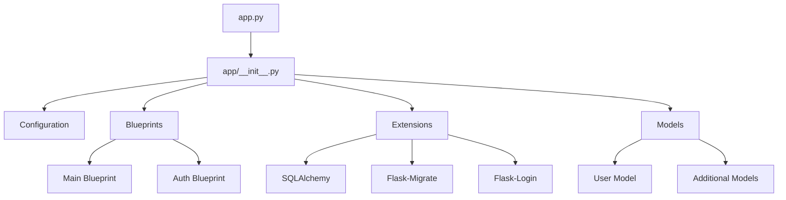
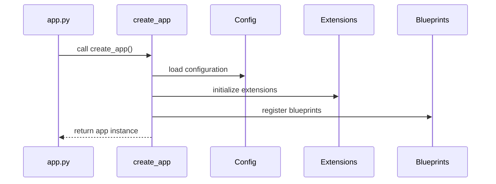
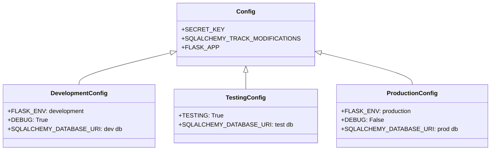
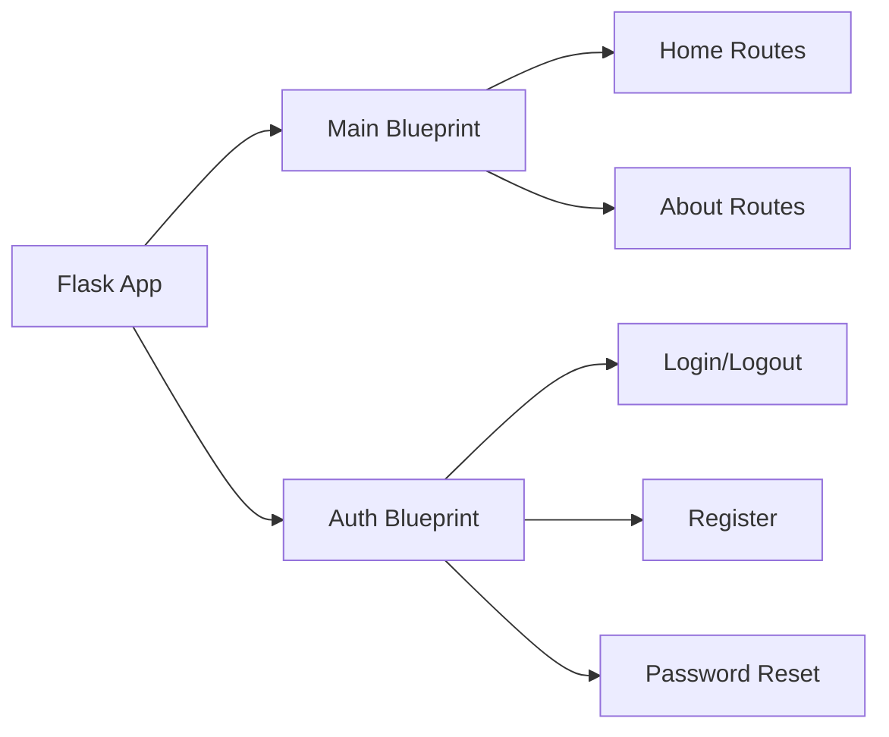
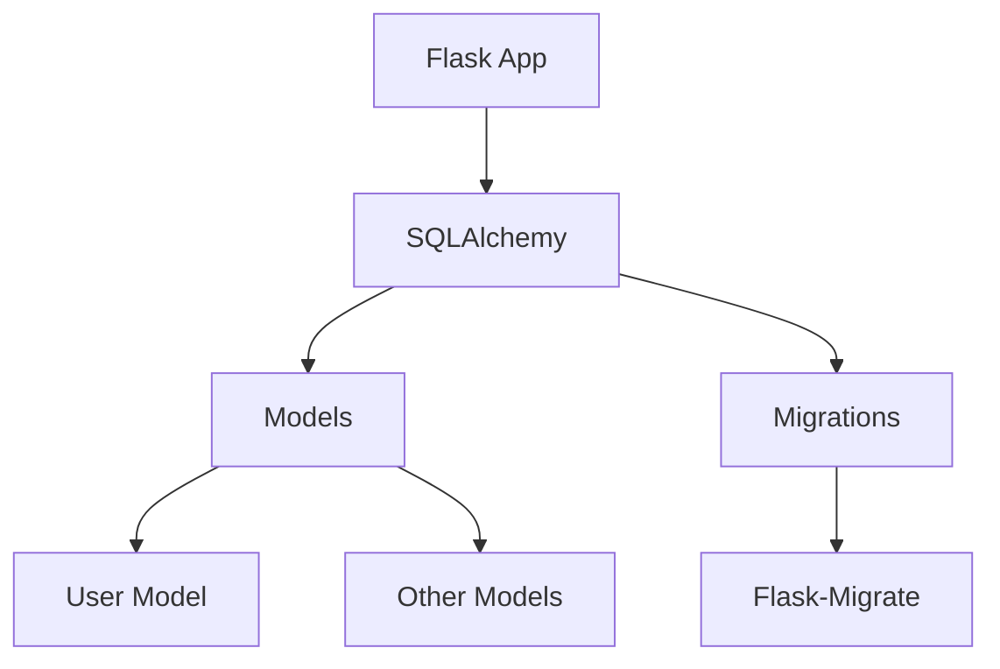
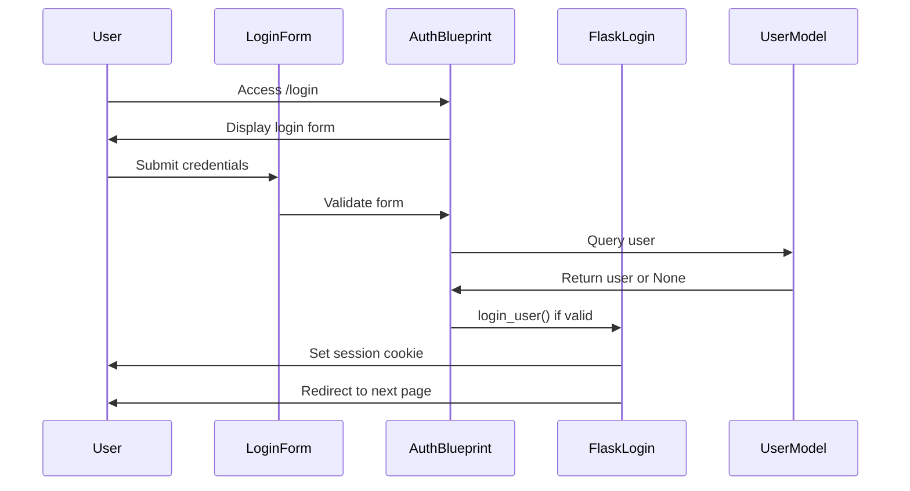
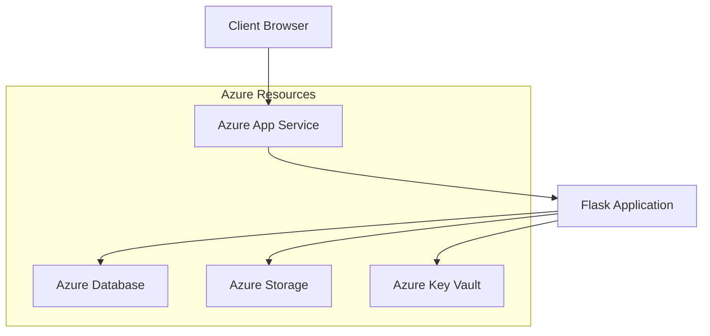

# A Fugue In Flask: Architecture Guide

This document provides a detailed overview of the architecture and implementation of the "A Fugue In Flask" template.

## Application Structure

"A Fugue In Flask" follows a modular architecture based on the Flask application factory pattern, which promotes separation of concerns and maintainability.



## Core Components

### Application Factory

The application factory pattern is a design pattern where the Flask application instance is created inside a function rather than at the module level. This allows for:

- Creating multiple application instances for testing or different configurations
- Applying configurations after the application is created
- Registering extensions and blueprints in a central location



### Configuration Management

The application uses a hierarchical configuration system that supports different environments:



### Blueprints

Blueprints are a way to organize related functionality in Flask applications:



## Database Integration

The application uses SQLAlchemy as an ORM (Object-Relational Mapper) with Flask-SQLAlchemy integration:



## Authentication Flow

The authentication system is built using Flask-Login:



## Azure Deployment Architecture

When deployed to Azure, the application follows this architecture:



## Directory Structure

```
A-Fugue-In-Flask/
├── app/                    # Application package
│   ├── __init__.py         # Application factory
│   ├── models/             # Database models
│   ├── routes/             # Route blueprints
│   ├── static/             # Static files (CSS, JS, images)
│   ├── templates/          # Jinja2 templates
│   └── utils/              # Utility functions
├── config/                 # Additional configuration files
├── docs/                   # Documentation
├── migrations/             # Database migrations
├── scripts/                # Utility scripts
├── tests/                  # Test suite
├── app.py                  # Application entry point
├── config.py               # Configuration classes
└── requirements.txt        # Dependencies
```

## Best Practices Implemented

1. **Environment Variables**: Sensitive configuration is loaded from environment variables
2. **Application Factory Pattern**: Modular design with separation of concerns
3. **Blueprints**: Organized code by feature
4. **ORM**: Database abstraction with SQLAlchemy
5. **Migrations**: Database schema evolution with Flask-Migrate
6. **Testing**: Comprehensive test suite structure
7. **Documentation**: Complete architecture and implementation documentation