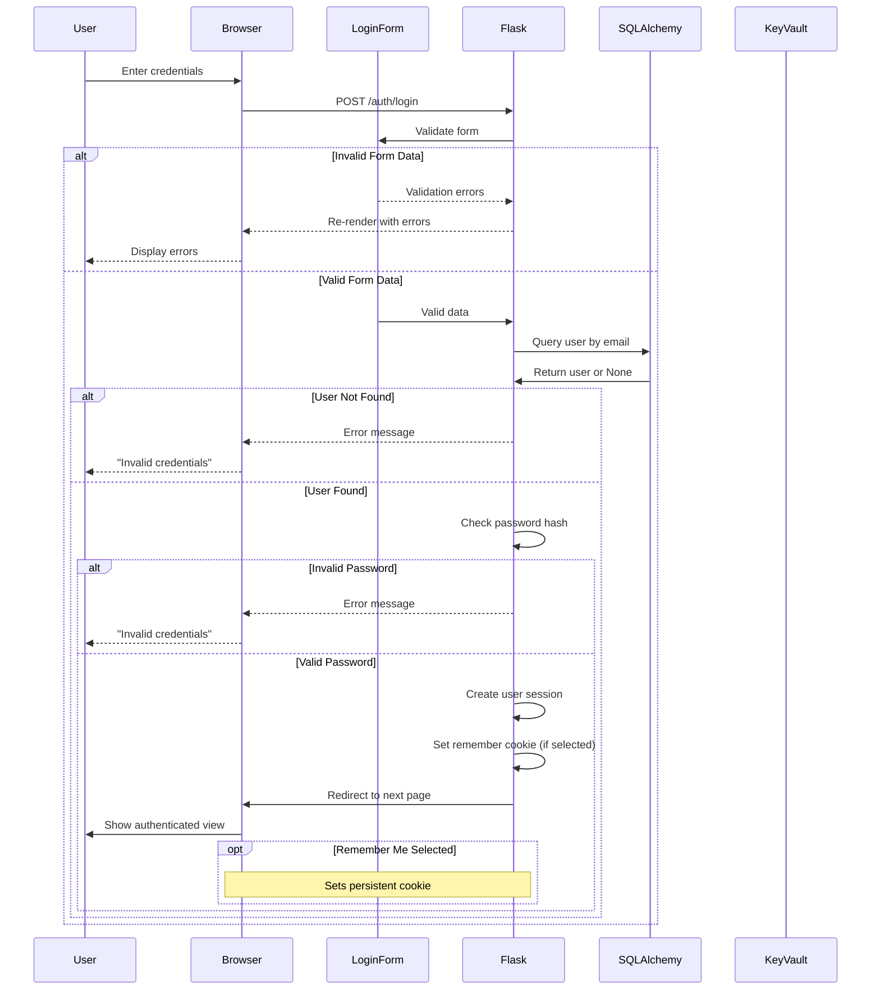

# Authentication System

This document outlines the authentication system used in the Flask application template.

## Overview

The authentication system implements user registration, login, and session management using:

- **Flask-Login**: Handles user sessions and "remember me" functionality
- **Werkzeug**: Provides secure password hashing and verification
- **SQLAlchemy**: Manages database operations for the User model
- **Flask-WTF**: Creates and validates authentication forms

## Authentication Flow

The application uses Flask-Login for authentication management. Here's the flow of the authentication process:



## Key Components

### User Model

The User model (`app/models/user.py`) defines the database structure for user accounts:

- `id`: Primary key
- `username`: Unique username (indexed)
- `email`: Unique email address (indexed)
- `password_hash`: Securely hashed password (256 characters)
- `is_active`: Flag for account status
- `created_at`: Timestamp of account creation
- `last_login`: Timestamp of last login

### Authentication Routes

Authentication endpoints (`app/routes/auth.py`):

- `/auth/register`: User registration
- `/auth/login`: User login
- `/auth/logout`: User logout

### Forms

Form validation (`app/forms/auth.py`):

- `LoginForm`: Email, password, and remember me fields
- `RegistrationForm`: Username, email, and password fields with validation

## Security Considerations

### Password Storage

Passwords are never stored in plain text:

- The application uses Werkzeug's `generate_password_hash` function to create secure password hashes
- Password hashes are stored in the `password_hash` column
- Modern password hashing algorithms generate longer hash strings than older algorithms
- The column size is set to 256 characters to accommodate these longer hashes

### Common Issues and Solutions

#### Password Hash Truncation

**Problem**: When using modern hashing algorithms like scrypt, the generated hash may exceed the column size in the database, causing truncation errors like:

```
String or binary data would be truncated in table 'database.dbo.users', column 'password_hash'
```

**Solution**:
- Increase the column size to 256 characters
- Create a database migration to alter existing columns
- See migration `7f23e04989ee_increase_password_hash_column_length_to_256.py` for implementation

#### Email Validation

**Problem**: Missing the `email_validator` package results in form validation errors.

**Solution**:
- Ensure `email_validator` is included in `requirements.txt`
- This package is required by WTForms to validate email fields

### Secure Configuration

- Store sensitive information in environment variables or Azure Key Vault
- Use HTTPS in production to protect credentials in transit
- Set up proper Cross-Origin Resource Sharing (CORS) policies
- Configure appropriate session lifetime and cookie security

## Database Integration

The authentication system works with multiple database backends:

- **SQLite**: For development and testing
- **PostgreSQL**: For production deployments
- **Azure SQL Database**: For Azure hosted applications

When using Azure SQL Database, ensure:
1. The database schema has appropriate column sizes for password hashes
2. Database connection strings are stored securely
3. Proper indices are created on frequently queried fields (username, email)

## Testing Authentication

To test the authentication system:

1. Register a new account
2. Log in with the registered credentials
3. Access protected routes
4. Test the "remember me" functionality
5. Verify logout functionality

## Future Enhancements

Possible improvements to the authentication system:

- Add email verification flow
- Implement password reset functionality
- Add two-factor authentication
- Support OAuth providers (Google, GitHub, etc.)
- Add rate limiting to prevent brute force attacks