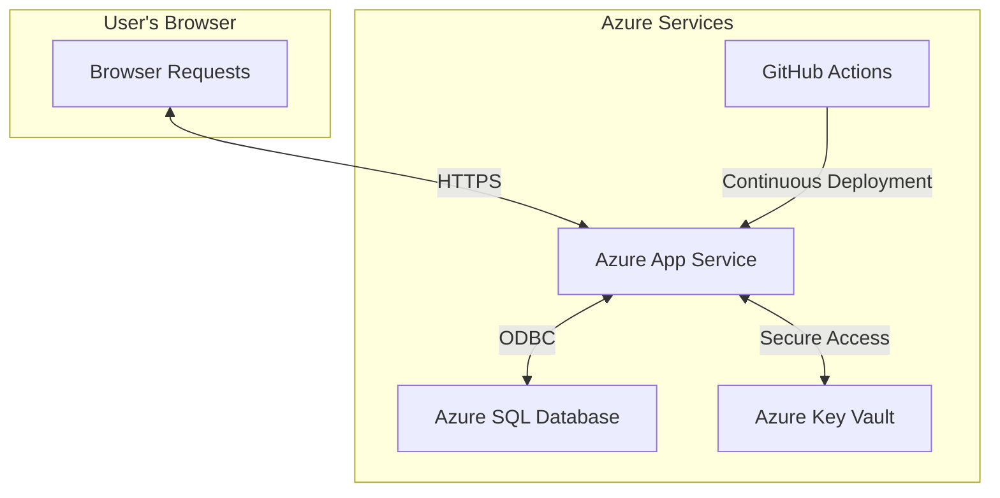

# Deploying A Fugue In Flask to Azure

This guide walks you through deploying your Flask application to Microsoft Azure App Service with an Azure SQL Database backend.

## Why Azure App Service?

Azure App Service is Microsoft's Platform-as-a-Service (PaaS) offering that's ideal for Flask applications:

- **Easy to deploy**: Streamlined deployment from Git or through CI/CD pipelines
- **Managed environment**: No need to worry about server management or patches
- **Built-in scaling**: Easily scale your application as needed
- **Integrated with Azure ecosystem**: Simple integration with other Azure services
- **Security**: Built-in authentication, HTTPS, and security features

## Prerequisites

Before deploying, ensure you have:

1. **Azure Account**: Create one at [portal.azure.com](https://portal.azure.com) (free tier available)
2. **Azure CLI** or **Azure PowerShell**: 
   - CLI: Install from [Microsoft's website](https://docs.microsoft.com/en-us/cli/azure/install-azure-cli)
   - PowerShell: Install from [PowerShell Gallery](https://docs.microsoft.com/en-us/powershell/azure/install-az-ps)
3. **Git**: Your project should be tracked in a Git repository
4. **GitHub Account**: For GitHub Actions CI/CD integration

## Deployment Architecture

Our deployment uses the following Azure services:



## Step-By-Step Deployment Guide

### 1. Azure Login and Subscription Selection

Login to Azure and select the appropriate subscription:

```bash
# Login to Azure
az login

# List available subscriptions
az account list --output table

# Set active subscription (replace with your subscription name)
az account set --subscription "Visual Studio Enterprise Subscription"
```

### 2. Resource Group Creation

Create a resource group to contain all of your application's Azure resources:

```bash
# Create a resource group
az group create --name flaskapp-rg --location westus
```

### 3. App Service Plan Creation

Create an App Service plan. This example uses the Free tier (F1) for testing:

```bash
# Create an App Service plan
az appservice plan create --name flask-free-plan --resource-group flaskapp-rg --location westus --sku F1 --is-linux
```

For production, consider using at least a Basic (B1) or Standard (S1) tier.

### 4. Web App Creation

Create a Web App using the App Service plan:

```bash
# Create a Web App
az webapp create --name flask-fugue-app --resource-group flaskapp-rg --plan flask-free-plan --runtime "PYTHON:3.9"
```

### 5. Key Vault Setup

Set up Azure Key Vault to securely store secrets like your database credentials:

```bash
# Create a Key Vault
az keyvault create --name flask-fugue-kv --resource-group flaskapp-rg --location westus

# Generate a secure random secret key
SECRET_KEY=$(openssl rand -hex 32)
az keyvault secret set --vault-name flask-fugue-kv --name "FLASK-SECRET-KEY" --value "$SECRET_KEY"

# Store database credentials securely
az keyvault secret set --vault-name flask-fugue-kv --name "DB-USERNAME" --value "sqladmin"
az keyvault secret set --vault-name flask-fugue-kv --name "DB-PASSWORD" --value "YourStrongPassword123!"
```

### 6. Azure SQL Database Setup

Create an Azure SQL Server and Database:

```bash
# Create SQL Server with secure admin credentials (from Key Vault)
DB_USERNAME=$(az keyvault secret show --vault-name flask-fugue-kv --name "DB-USERNAME" --query value -o tsv)
DB_PASSWORD=$(az keyvault secret show --vault-name flask-fugue-kv --name "DB-PASSWORD" --query value -o tsv)

az sql server create --name flask-template-sqlserver --resource-group flaskapp-rg --location westus \
  --admin-user "$DB_USERNAME" --admin-password "$DB_PASSWORD"

# Create SQL Database (Basic tier)
az sql db create --resource-group flaskapp-rg --server flask-template-sqlserver --name flask-template-db --service-objective Basic

# Configure firewall to allow Azure services
az sql server firewall-rule create --resource-group flaskapp-rg --server flask-template-sqlserver \
  --name "AllowAllAzureServices" --start-ip-address 0.0.0.0 --end-ip-address 0.0.0.0
```

### 7. Enable Managed Identity for your Web App

For secure access to Azure Key Vault and potentially Azure SQL:

```bash
# Enable system-assigned managed identity
az webapp identity assign --name flask-fugue-app --resource-group flaskapp-rg

# Get the principal ID of the assigned identity
PRINCIPAL_ID=$(az webapp identity show --name flask-fugue-app --resource-group flaskapp-rg --query principalId -o tsv)

# Grant the identity access to Key Vault secrets
az keyvault set-policy --name flask-fugue-kv --object-id $PRINCIPAL_ID \
  --secret-permissions get list
```

### 8. Application Settings Configuration

Configure your web app settings to include environment variables:

```bash
# Get the SQL server FQDN
SQL_SERVER="flask-template-sqlserver.database.windows.net"

# Set application settings using Key Vault references
az webapp config appsettings set --name flask-fugue-app --resource-group flaskapp-rg --settings \
    FLASK_CONFIG="production" \
    SECRET_KEY="@Microsoft.KeyVault(SecretUri=https://flask-fugue-kv.vault.azure.net/secrets/FLASK-SECRET-KEY/)" \
    DB_SERVER="$SQL_SERVER" \
    DB_NAME="flask-template-db" \
    DB_USERNAME="@Microsoft.KeyVault(SecretUri=https://flask-fugue-kv.vault.azure.net/secrets/DB-USERNAME/)" \
    DB_PASSWORD="@Microsoft.KeyVault(SecretUri=https://flask-fugue-kv.vault.azure.net/secrets/DB-PASSWORD/)" \
    USE_CENTRALIZED_DB="True"
```

### 9. Continuous Deployment with GitHub Actions

Set up GitHub Actions for continuous deployment:

1. Create a `.github/workflows/azure-deploy.yml` file:

```yaml
name: Deploy Flask app to Azure App Service

on:
  push:
    branches:
      - main
      - master
  workflow_dispatch:

jobs:
  build-and-deploy:
    runs-on: ubuntu-latest
    
    steps:
    - name: Checkout code
      uses: actions/checkout@v3
    
    - name: Set up Python
      uses: actions/setup-python@v4
      with:
        python-version: '3.9'
    
    - name: Install dependencies
      run: |
        python -m pip install --upgrade pip
        pip install -r requirements.txt
    
    - name: Install ODBC Driver
      run: |
        curl https://packages.microsoft.com/keys/microsoft.asc | apt-key add -
        curl https://packages.microsoft.com/config/ubuntu/$(lsb_release -rs)/prod.list > /etc/apt/sources.list.d/mssql-release.list
        apt-get update
        ACCEPT_EULA=Y apt-get install -y msodbcsql17
    
    - name: Deploy to Azure Web App
      uses: azure/webapps-deploy@v2
      with:
        app-name: 'flask-fugue-app'
        publish-profile: ${{ secrets.AZURE_WEBAPP_PUBLISH_PROFILE }}
        package: .
```

2. Get the publish profile from Azure:

```bash
# Download publish profile
az webapp deployment list-publishing-profiles --name flask-fugue-app --resource-group flaskapp-rg --xml > azure-publish-profile.xml
```

3. Add the publish profile as a GitHub secret:

```bash
# Using GitHub CLI (or add it manually through the GitHub web interface)
gh secret set AZURE_WEBAPP_PUBLISH_PROFILE --body "$(cat azure-publish-profile.xml)"
```

### 10. Azure Startup Script Configuration

Create a startup script specifically for Azure deployment:

1. Create `startup_azure.sh` in your project root:

```bash
#!/bin/bash

echo "Starting Azure deployment script"

# Load required modules for Azure SQL
echo "Loading ODBC drivers and modules"

# Apply database migrations or create schema
echo "Setting up database schema"
if [ "$USE_CENTRALIZED_DB" = "True" ]; then
  echo "Using Azure SQL Database"
  
  # Try running the direct DB initialization script
  python -m scripts.direct_db_test || echo "Failed to initialize database directly"
  
  # Try running schema updates
  python -m scripts.update_schema || echo "Failed to update schema"
  
  # Fall back to standard migrations if needed
  flask db upgrade || echo "Failed to apply migrations"
else
  echo "Using local SQLite database"
  python -m scripts.init_db
fi

# Start Gunicorn server
echo "Starting Gunicorn server"
exec gunicorn --bind=0.0.0.0:8000 --timeout 600 "app:create_app()"
```

2. Make the script executable and configure the web app to use it:

```bash
# Make executable
chmod +x startup_azure.sh

# Configure Azure to use the script
az webapp config set --name flask-fugue-app --resource-group flaskapp-rg --startup-file "startup_azure.sh"
```

## Monitoring and Management

### Viewing Application Logs

```bash
# View logs in real-time
az webapp log tail --name flask-fugue-app --resource-group flaskapp-rg
```

### Monitoring Application Performance

Add Azure Application Insights for detailed monitoring:

```bash
# Create Application Insights
az monitor app-insights component create --app flask-app-insights --location westus --resource-group flaskapp-rg

# Get the instrumentation key
INSTRUMENTATION_KEY=$(az monitor app-insights component show --app flask-app-insights --resource-group flaskapp-rg --query instrumentationKey -o tsv)

# Add to app settings
az webapp config appsettings set --name flask-fugue-app --resource-group flaskapp-rg --settings APPLICATIONINSIGHTS_CONNECTION_STRING="InstrumentationKey=$INSTRUMENTATION_KEY"
```

## Cost Management and Optimization

Our deployment uses cost-effective services:

- **App Service Plan**: Free tier (F1) for development, consider Basic (B1) for production (~$13/month)
- **Azure SQL Database**: Basic tier (~$5/month)
- **Azure Key Vault**: Free tier for up to 10,000 operations/month

To further optimize costs:

1. Use the App Service's auto-scaling in production to scale based on demand
2. Consider shared compute resources for non-critical applications
3. Set up budget alerts to monitor spending

## Troubleshooting Common Issues

### Azure SQL Connection Issues

1. **Firewall Issues**:
   - Check if the Azure App Service IP is allowed in the SQL firewall
   - Verify the "Allow Azure Services" rule is enabled

2. **ODBC Driver Issues**:
   - Ensure the ODBC Driver is available on the App Service
   - Run the connection troubleshooting script remotely:
   ```bash
   az webapp ssh --name flask-fugue-app --resource-group flaskapp-rg
   # In the SSH session
   cd site/wwwroot
   python -m scripts.azure_sql_fix
   ```

3. **Connection String Errors**:
   - Check if environment variables are correctly set
   - Verify Key Vault permissions if using Key Vault references

### GitHub Actions Authentication Issues

If you encounter authentication errors in your GitHub Actions workflow:

1. Create a service principal for Azure authentication:
   ```bash
   az ad sp create-for-rbac --name "flask-fugue-github-actions" --role contributor --scopes /subscriptions/YOUR_SUBSCRIPTION_ID/resourceGroups/flaskapp-rg --sdk-auth > azure_credentials.json
   ```

2. Add the output JSON as a GitHub secret:
   ```bash
   gh secret set AZURE_CREDENTIALS --body "$(cat azure_credentials.json)"
   
   # Delete the local credentials file for security
   rm azure_credentials.json
   ```

3. Update your GitHub Actions workflow to include an Azure login step:
   ```yaml
   - name: Azure Login
     uses: azure/login@v1
     with:
       creds: ${{ secrets.AZURE_CREDENTIALS }}
   ```

## Security Best Practices

1. **Never hardcode credentials** in scripts or source code
2. **Use Azure Key Vault** for storing sensitive information
3. **Implement Managed Identity** for secure access to Azure resources
4. **Enable HTTPS** and enforce TLS 1.2+
5. **Configure proper access controls** and follow the principle of least privilege
6. **Use environment variables** for configuration
7. **Regularly audit** and rotate credentials

## Further Resources

- [Azure App Service Documentation](https://docs.microsoft.com/en-us/azure/app-service/)
- [Azure SQL Database Documentation](https://docs.microsoft.com/en-us/azure/azure-sql/)
- [Azure Key Vault Documentation](https://docs.microsoft.com/en-us/azure/key-vault/)
- [GitHub Actions for Azure](https://github.com/Azure/actions)
- [pyodbc Documentation](https://github.com/mkleehammer/pyodbc/wiki)
