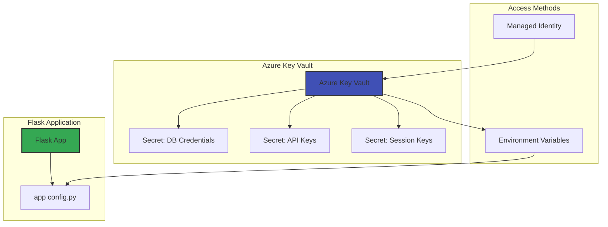
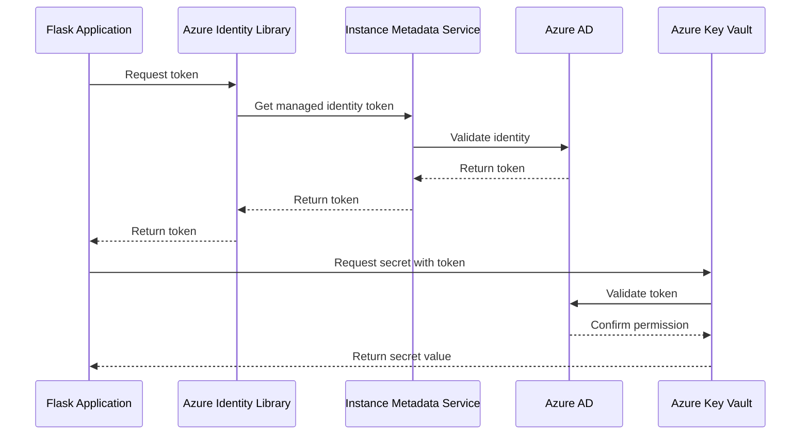

# Azure Key Vault Integration

This document explains how to securely manage secrets for your Flask application using Azure Key Vault.

## Why Use Azure Key Vault?

When deploying applications to Azure (or any cloud platform), it's essential to follow security best practices, especially for sensitive information like:

- Database credentials
- API keys
- Session secrets
- Authentication tokens

Azure Key Vault provides a secure solution that offers:

1. **Centralized secret management**: Store all secrets in one secure location
2. **Access control**: Granular permissions for who can access which secrets
3. **Audit logging**: Track when secrets are accessed and by whom
4. **Rotation policies**: Easily update and rotate secrets without redeploying applications
5. **Encrypted storage**: All secrets are encrypted at rest and in transit



## Setting Up Azure Key Vault

### 1. Create a Key Vault

Using Azure CLI:

```bash
# Create a Key Vault (replace VAULT_NAME with your desired name)
az keyvault create --name flask-fugue-kv --resource-group flaskapp-rg --location westus
```

### 2. Add Secrets to Key Vault

```bash
# Generate a random Flask secret key
SECRET_KEY=$(openssl rand -hex 32)

# Store it in Key Vault
az keyvault secret set --vault-name flask-fugue-kv --name "FLASK-SECRET-KEY" --value "$SECRET_KEY"

# Store database credentials
az keyvault secret set --vault-name flask-fugue-kv --name "DB-USERNAME" --value "sqladmin"
az keyvault secret set --vault-name flask-fugue-kv --name "DB-PASSWORD" --value "YourStrongPassword123!"
```

## Accessing Key Vault from Flask

### Method 1: Environment Variables (Recommended for App Service)

With this approach, you:
1. Retrieve secrets from Key Vault during deployment
2. Set them as environment variables in App Service
3. Access them in your Flask app like regular environment variables

```bash
# During deployment, get secrets and set as App Service settings
SECRET_KEY=$(az keyvault secret show --vault-name flask-fugue-kv --name "FLASK-SECRET-KEY" --query value -o tsv)
DB_USERNAME=$(az keyvault secret show --vault-name flask-fugue-kv --name "DB-USERNAME" --query value -o tsv)
DB_PASSWORD=$(az keyvault secret show --vault-name flask-fugue-kv --name "DB-PASSWORD" --query value -o tsv)

# Set as app settings
az webapp config appsettings set --name flask-fugue-app --resource-group flaskapp-rg --settings \
    SECRET_KEY="$SECRET_KEY" \
    DB_USERNAME="$DB_USERNAME" \
    DB_PASSWORD="$DB_PASSWORD"
```

### Method 2: Direct Key Vault Access

For more advanced scenarios, your app can access Key Vault directly:

1. Install the Azure Identity and Key Vault packages:
   ```
   pip install azure-identity azure-keyvault-secrets
   ```

2. Add code to your Flask app to access Key Vault:
   ```python
   from azure.identity import DefaultAzureCredential
   from azure.keyvault.secrets import SecretClient

   def get_secret(secret_name):
       """Retrieve a secret from Azure Key Vault."""
       credential = DefaultAzureCredential()
       vault_url = f"https://flask-fugue-kv.vault.azure.net/"
       client = SecretClient(vault_url=vault_url, credential=credential)
       return client.get_secret(secret_name).value
   
   # Use in your config.py
   SECRET_KEY = get_secret("FLASK-SECRET-KEY")
   DB_USERNAME = get_secret("DB-USERNAME")
   DB_PASSWORD = get_secret("DB-PASSWORD")
   ```

3. Configure Managed Identity for your App Service:
   ```bash
   # Enable system-assigned managed identity
   az webapp identity assign --name flask-fugue-app --resource-group flaskapp-rg
   
   # Get the identity's principal ID
   PRINCIPAL_ID=$(az webapp identity show --name flask-fugue-app --resource-group flaskapp-rg --query principalId --output tsv)
   
   # Grant access to Key Vault
   az keyvault set-policy --name flask-fugue-kv --object-id $PRINCIPAL_ID --secret-permissions get list
   ```

The authentication flow using Managed Identity follows this sequence:



## Best Practices

1. **Never hardcode secrets** in your application code or configuration files
2. **Grant minimum required permissions** to your application identities
3. **Set up automatic secret rotation** for database credentials and API keys
4. **Use different secrets for different environments** (development, testing, production)
5. **Monitor Key Vault access** through Azure Monitor and alerts

## Troubleshooting

### Common Issues:

1. **Permission denied errors**:
   - Verify the managed identity is properly assigned
   - Check Key Vault access policies to ensure the identity has get/list permissions

2. **Secrets not loading**:
   - Check if the secret names match exactly (case-sensitive)
   - Ensure the Key Vault URL is correct

3. **Deployment failing**:
   - Verify that deployment scripts have access to Key Vault
   - Ensure GitHub Actions secrets are properly configured

## Further Reading

- [Azure Key Vault Documentation](https://docs.microsoft.com/en-us/azure/key-vault/)
- [Python SDK for Azure Key Vault](https://docs.microsoft.com/en-us/python/api/overview/azure/keyvault-secrets-readme)
- [Managed Identities for Azure Resources](https://docs.microsoft.com/en-us/azure/active-directory/managed-identities-azure-resources/)
