# Flask in the Web Development Ecosystem

This document explains how Flask and the "A Fugue In Flask" implementation fit into the broader landscape of web development architectures and frameworks.

## Where Flask Fits in the Web Development Stack

### The Web Development Stack Hierarchy

Web applications typically consist of several layers:

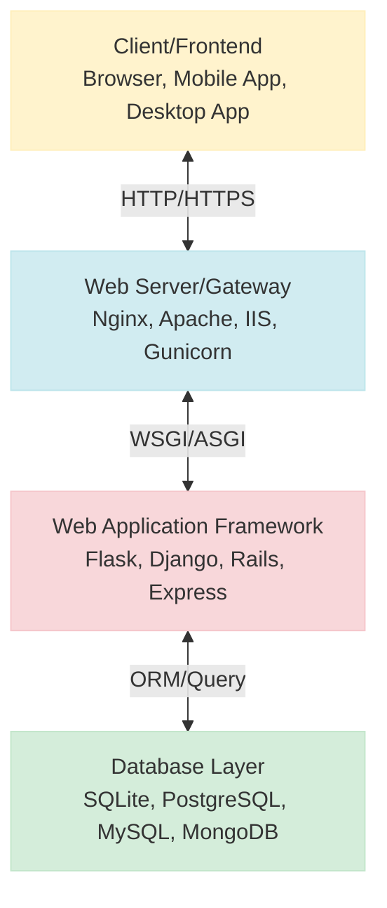

Flask occupies the **Web Application Framework** layer of this stack (highlighted in pink). It handles HTTP requests, processes application logic, and generates responses.

### Flask as a "Micro" Framework

Flask is often described as a "micro" framework, which doesn't mean it's only suitable for small applications, but rather:

1. It has a small core with minimal dependencies
2. It doesn't make decisions for you (like database choice)
3. It's highly extensible through extensions and libraries
4. It focuses on being lightweight and flexible

This is in contrast to "batteries-included" frameworks like Django that provide more built-in functionality.

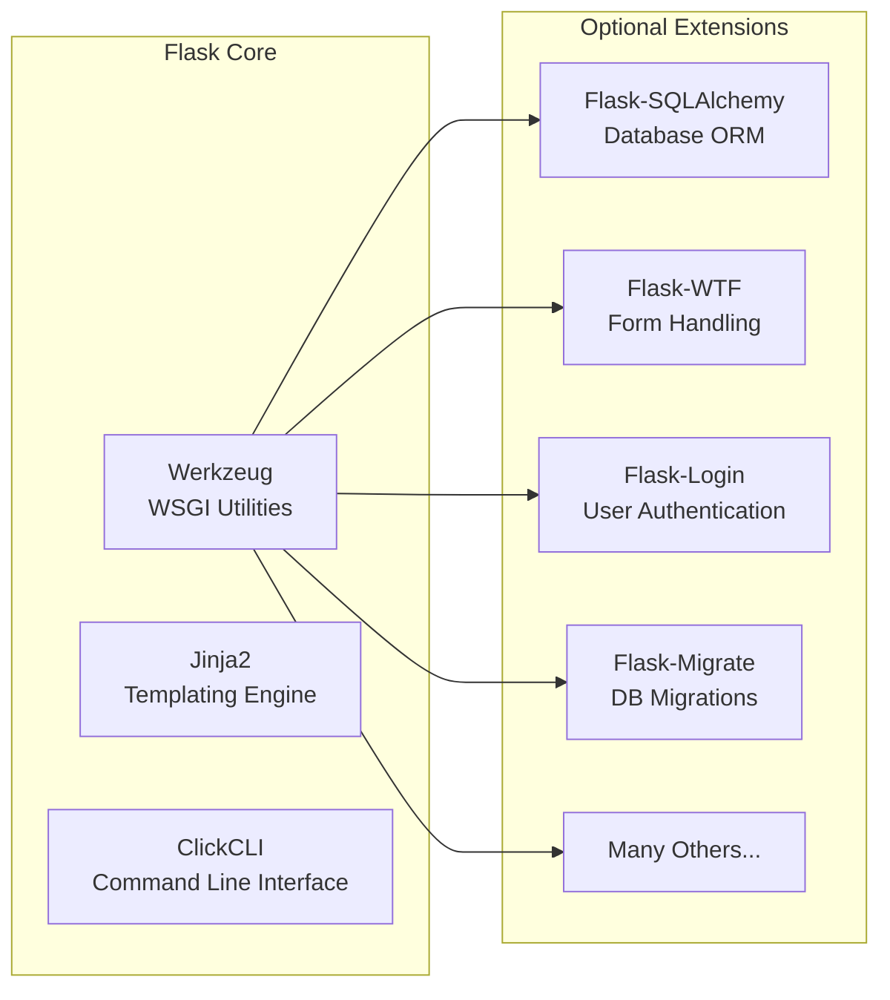

## Architectural Patterns in Our Implementation

Our "A Fugue In Flask" implementation uses several architectural patterns:

### 1. Model-View-Controller (MVC) Pattern

While Flask doesn't strictly enforce MVC, our implementation follows this pattern:

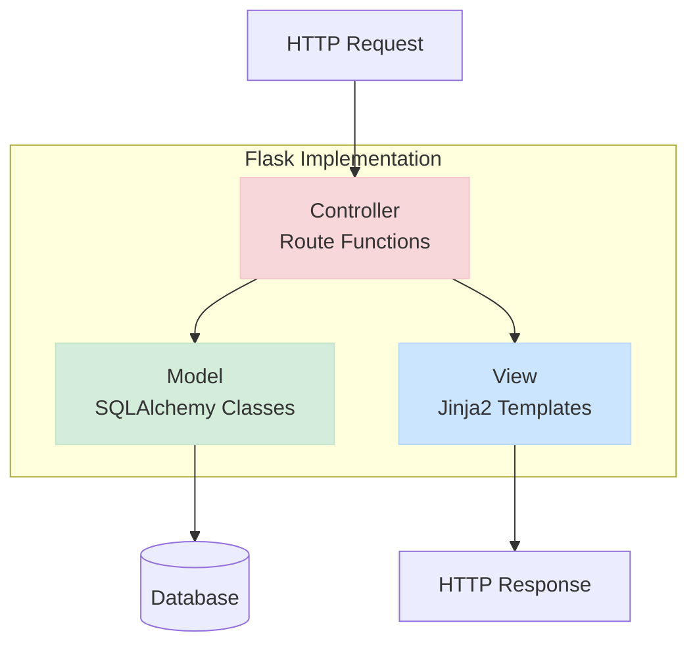

- **Models**: SQLAlchemy models (`app/models/`) define data structure and database interactions
- **Views**: Jinja2 templates (`app/templates/`) handle presentation logic
- **Controllers**: Route functions (`app/routes/`) process requests and control application flow

### 2. Application Factory Pattern

The application factory pattern allows for multiple application instances with different configurations:

```mermaid
flowchart TD
    A[app.py] --> B[create_app&#40;&#41;]
    
    B --> C[Development App Instance]
    B --> D[Testing App Instance]
    B --> E[Production App Instance]
    
    C --> F[Development Database]
    D --> G[Testing Database]
    E --> H[Production Database]
```

### 3. Blueprint Pattern

Blueprints in Flask are modular components that encapsulate related functionality:

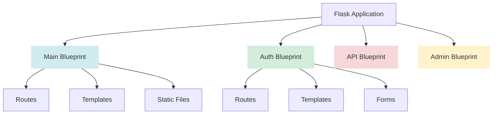

## Where "A Fugue In Flask" Sits in Common Web Architecture Categories

### Front-end vs. Back-end

Our implementation is primarily a **back-end** application that:

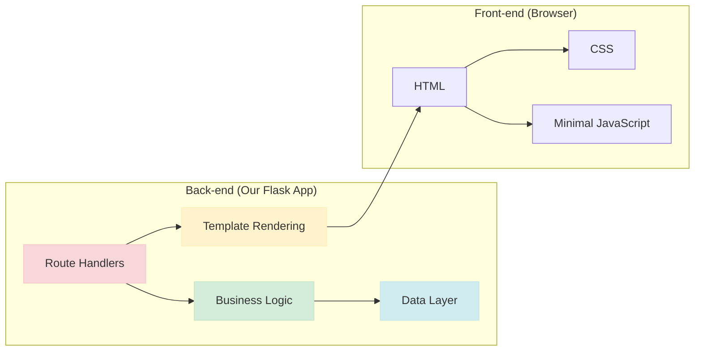

### Monolithic vs. Microservices

Our application follows a **monolithic architecture**:

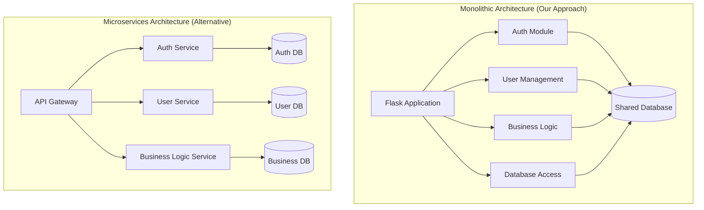

### Data-Driven vs. Document-Driven

Our application is **data-driven**, using a relational database with a defined schema:

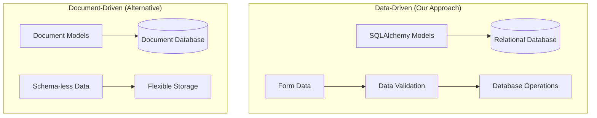

## Deployment Architecture with Azure

When deployed to Azure, our application uses the following architecture:

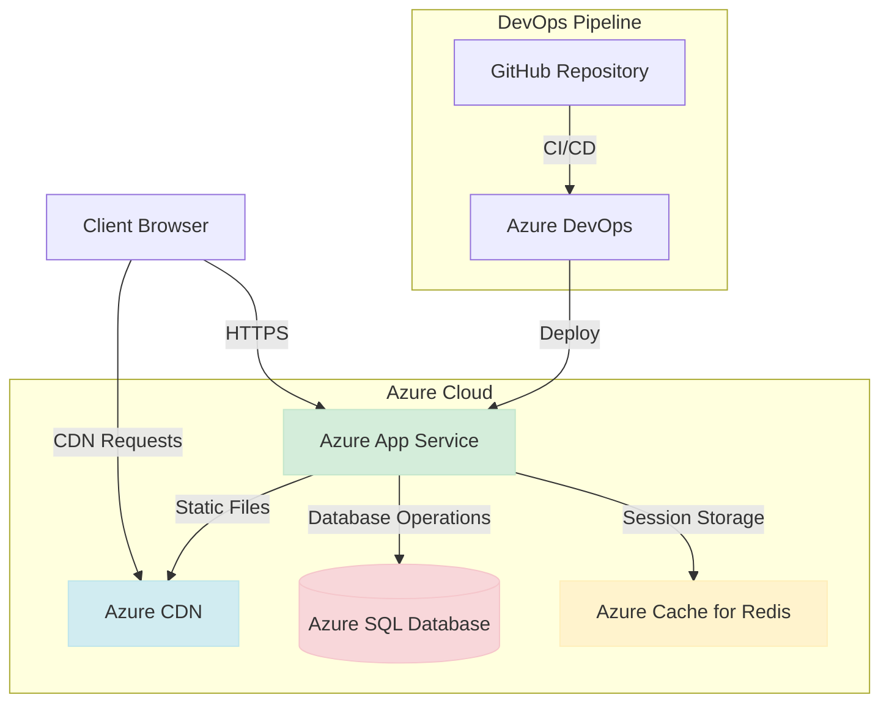

## Comparison to Other Web Stacks

Here's a comparison of different web development stacks:

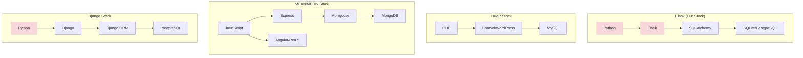

## When to Choose Flask (and This Architecture)

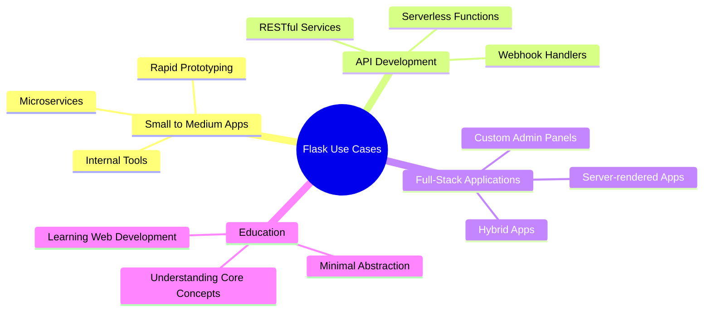

## Modern Web Development Context

In modern web development, Flask often serves as:

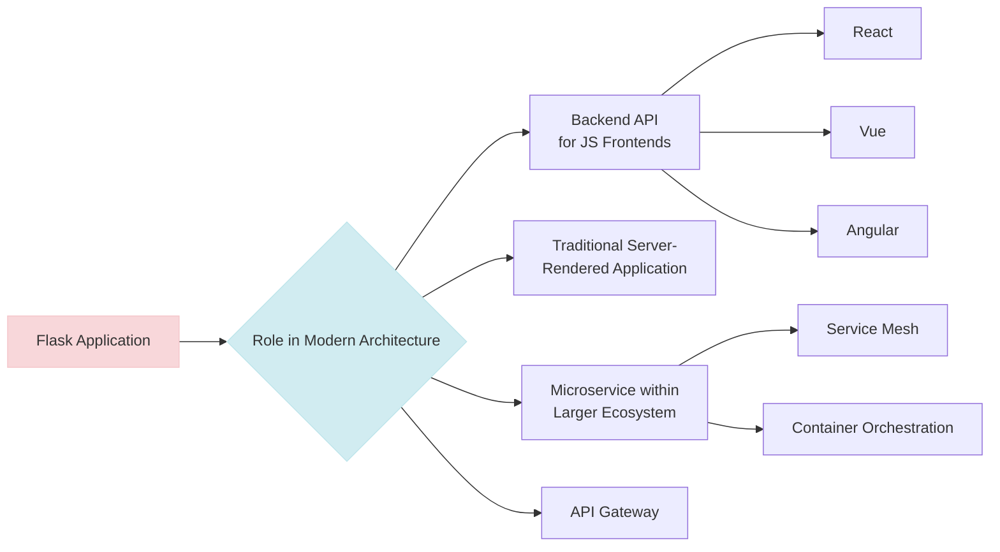

Our implementation provides a solid foundation that can be adapted to any of these approaches as requirements evolve.